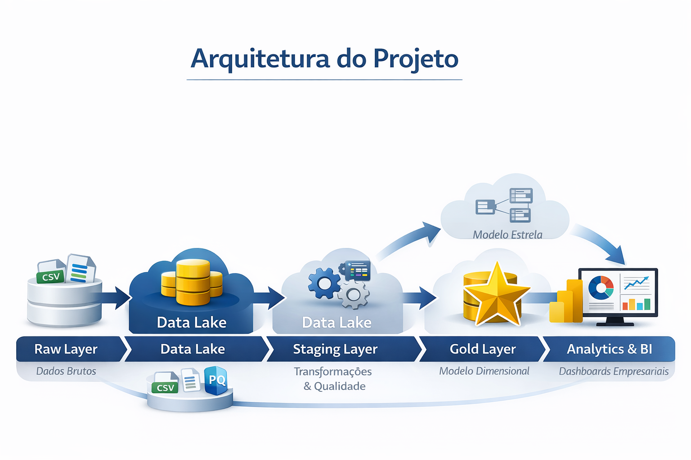
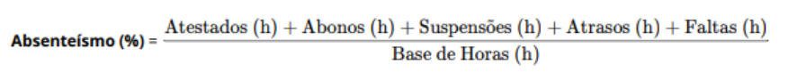
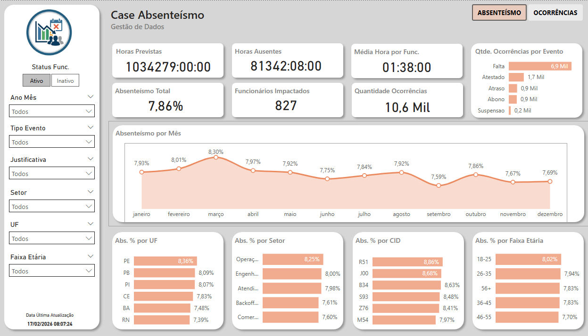
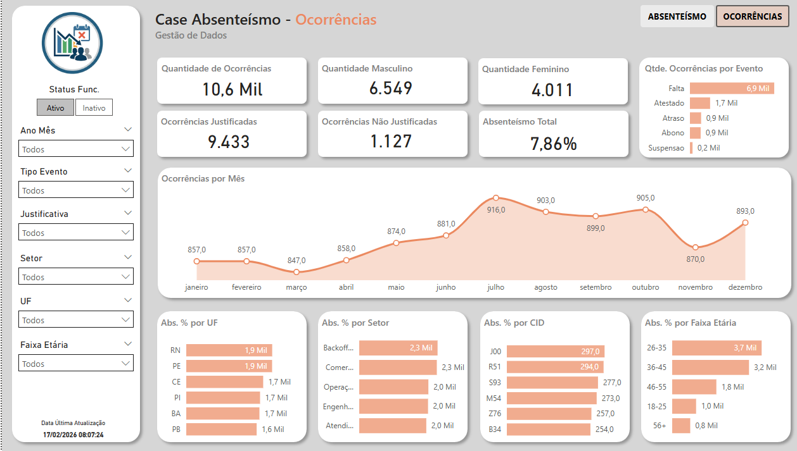

# 📊 Projeto de Análise de Absenteísmo

Este projeto tem como objetivo construir um pipeline de dados ponta a ponta para análise de absenteísmo corporativo, desde a ingestão das bases até a disponibilização de um modelo dimensional otimizado para consumo em ferramentas de Business Intelligence.

A solução foi estruturada seguindo boas práticas de engenharia de dados, com separação em camadas e foco em escalabilidade.

  

# ⚙️ Estrutura do projeto

CASE-ABSENTEISMO/
│
├── banco_de_eventos/              # Arquivos brutos de eventos de absenteísmo
├── banco_de_headcount/           # Base de colaboradores
├── bancos_complementares/        # Bases auxiliares (CID, dados demográficos, etc.)
│
├── Dashboard/                    # Arquivo do Power BI
│
├── data/                         # Camadas do pipeline de dados
│   ├── raw/                      # Dados ingeridos sem tratamento
│   ├── bronze/                   # Persistência inicial (opcional para histórico)
│   ├── silver/                   # Dados tratados e padronizados
│   ├── stg/                      # Área de staging com regras de negócio
│   └── gold/                     # Camada analítica (modelo dimensional)
│
├── imagens/                      # Diagramas e imagens utilizadas no README
│
├── notebooks/                    # Análises exploratórias e validações
│
├── src/
│   └── Cargas/                   # Scripts de engenharia de dados
│       ├── Raw/                  # Scripts de ingestão
│       ├── Staging/              # Scripts de transformação
│       └── Gold/                 # Scripts de modelagem analítica
│
├── Case Absenteismo.pdf          # Documento do desafio
└── README.md

# ⚙️ Execução do Projeto

A execução ocorre de forma sequencial, respeitando as camadas do pipeline:

## 1️⃣ Ingestão (RAW)

- Leitura dos arquivos CSV originais e armazenamento em formato Parquet, preservando os dados brutos para rastreabilidade e auditoria.

## 2️⃣ Tratamento (STAGING)

- Aplicação de regras de qualidade e padronização:

- Remoção de duplicidades

- Conversão de tipos

- Padronização de colunas

- Garantia de granularidade funcionário x mês

- Validação de schema

## 3️⃣ Camada Analítica (GOLD)

Construção do modelo dimensional:

- Fato

    - gold_fato_absenteismo → eventos de absenteísmo aprovados

- Dimensões

    - gold_dim_tempo → calendário diário (2025–2031)

    - gold_dim_funcionario_mes → atributos do funcionário por mês

    - gold_dim_cid → classificação médica

O modelo foi projetado no formato estrela, garantindo melhor performance no Power BI.

## 🧠 Suposições de Negócio

- Algumas premissas foram adotadas devido à ausência de regras explícitas:

- Apenas eventos com status = "Aprovado" foram considerados no cálculo.

- Funcionários foram tratados na granularidade funcionário x mês, permitindo análises temporais consistentes.

- Registros duplicados no headcount foram resolvidos priorizando status ativo e a maior carga horária mensal.

- Eventos sem CID foram tratados como categoria “Não informado” para preservar integridade relacional.

## 🎯 Principais Decisões Técnicas

- Uso do formato Parquet para melhor compressão e performance.

- Criação de chave composta (chave_func_mes) para simplificar relacionamentos no modelo dimensional.

- Separação em camadas (Raw → Staging → Gold) seguindo arquitetura moderna de dados.

- Validações de schema para evitar falhas silenciosas no pipeline.

- Construção de uma dimensão de tempo independente para suportar análises históricas.

# 📊 Dashboarb - Absenteísmo e Ocorrências

Foi desenvolvido um dashboard interativo no Power BI com o objetivo de fornecer uma visão estratégica sobre os indicadores de absenteísmo, permitindo identificar padrões, causas e oportunidades de melhoria operacional.

O painel foi construído a partir de um modelo dimensional (fato + dimensões), garantindo alta performance nas consultas e flexibilidade analítica.

## 📌 Principais Indicadores (KPIs)

- Taxa de Absenteísmo (%)
- Total de Horas Perdidas
- Quantidade de Funcionários Impactados
- Média de Horas por Ocorrência
- Distribuição por Tipo de Evento
- Ranking de CIDs (atestados médicos)
- Ocorrências (Eventos que e seus motivos)

  

### 📊 Visão de Absenteísmo
 

### 📊 Visão das Ocorrências

# 🚀 Próximos Passos (Evolução da Arquitetura)

A pipeline foi estruturado para permitir fácil migração para um ambiente cloud e maior nível de automação.

## Evoluções:

    ☁️ Cloud & Data Platform

    - Armazenamento em Data Lake (Azure Data Lake / Google Cloud Storage)

    - Processamento distribuído com Databricks ou BigQuery

    - Orquestração com Apache Airflow ou Azure Data Factory

    - Camada semântica com dbt

    🔄 Engenharia de Dados

    - Implementação de cargas incrementais

    - Criação de testes automatizados de qualidade

    - Monitoramento do pipeline

    - Versionamento de dados